---
output:
  xaringan::moon_reader:
  #  self_contained: TRUE
    includes:
      in_header: conf/style-header.html
    lib_dir: assets
    seal: false
    css: ["default", "conf/css/style.css", "conf/css/fonts.css"]
    nature:
      beforeInit: "conf/style-macros.js"
---

```{r setup, echo = F}
knitr::opts_chunk$set(
  comment = "#",
  collapse = TRUE,
  #cache = TRUE,
  warning = FALSE,
  message = FALSE,
  fig.width=6, fig.height=6,
  fig.align = 'center'
)
```
class: middle, title-slide

# The effect of forest management on the response of forest to climate change

### .large[Willian Vieira], PhD candidate <br> Dominique Gravel and Robert Bradley

<i class="fa fa-github fa-2x" style="color:#335049"></i> [WillVieira/talk_STM-QCBS2018](https://github.com/willvieira/talk_STM-QCBS2018)

---
## Challenge: future distribution under climate change

.center[
  
]

.cite[McKenney et al. [2007](https://academic.oup.com/bioscience/article/57/11/939/234280) BioScience]

---
## Trees are lagging behind climate change

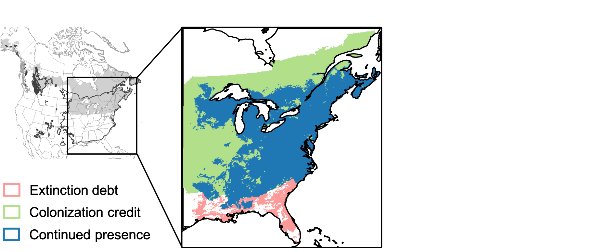

.cite[Talluto et al. [2017](https://www.nature.com/articles/s41559-017-0182) Nat. Ecol. Evol.]

---
## Possible consequences?

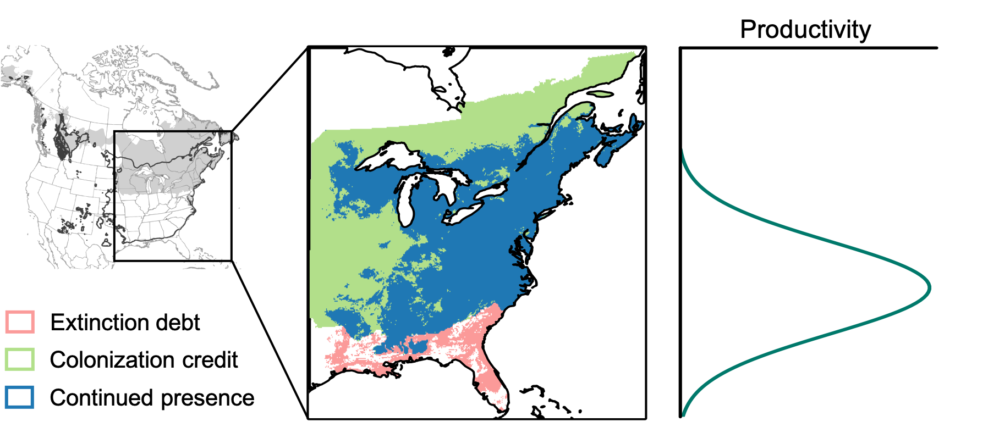

---
## Possible consequences?

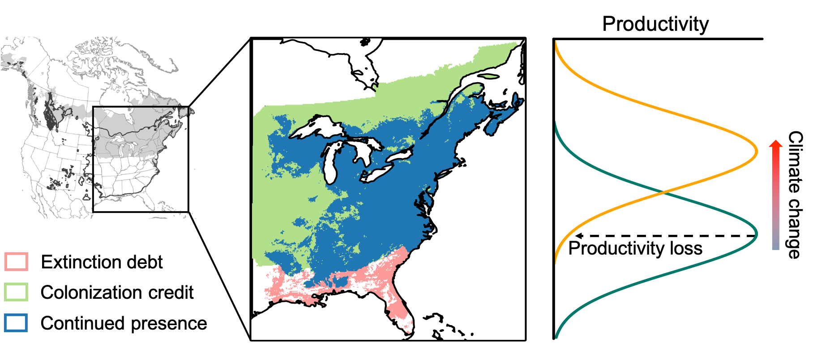

---
## Transitory dynamic under perturbation

```{r,echo=F}
## Figure to explain transitory dynamic
  sigmoid <- function(x) {
     1 / (1 + exp(-x))
  }
  # generate data
  x <- seq(-10, 10, 0.01)
  y <- sigmoid(-x)
  Green = rgb(51, 80, 73, maxColorValue = 255)
  Gray = rgb(90, 90, 90, maxColorValue = 255)
```
```{r,echo=F}
  # plot as a function
  transPlot <- function(transp = F) {
    letCol = ifelse(transp == T, 'grey', 'black')
    par(xaxs="i", yaxs="i", mar = c(5, 5, 2, 0.5))
    plot(x, y, pch = '', axes = FALSE, lwd = 3.5, xlab = "", ylab = "", ylim = c(-.1, 1.2), xaxt = "n", yaxt = "n")
    axis(1, at = c(-20, 20), lwd = 2.5)
    axis(2, at = c(-5, 5), lwd = 2.5)
    mtext("Time", 1, cex = 1.6, line = 0.6, col = letCol)
    mtext('Abundance', 2, cex = 1.6, line = 0.3, col = letCol)
  }
```
```{r,echo=F,fig.height=5, fig.width=7}
  # plot
  transPlot()
  mtext('', cex = 1.5, side = 3, line = -0.7, at = -6.8)
```

---
## Transitory dynamic under perturbation

```{r,echo=F,fig.height=5, fig.width=7}
transPlot()
lines(x[1:300], y[1:300], col = Green, lwd = 3.5)
mtext('', cex = 1.5, side = 3, line = -0.7, at = -6.8)
```

---
## Transitory dynamic under perturbation

```{r,echo=F,fig.height=5, fig.width=7}
transPlot()
lines(x[1:300], y[1:300], col = Green, lwd = 3.5)
mtext('Climate change', cex = 1.5, side = 3, line = -0.7, at = -6.8)
mtext(expression(symbol("\257")), at = -6.8, side = 3, line = -2.8, cex = 2.5, col = 'red')
abline(h = min(y), lwd = 2, lty =2, col = Gray)
mtext('New equilibrium after CC', cex = 1.4, side = 1, line = -2.5, at = -5, col = Gray)
```

---
## Transitory dynamic under perturbation

```{r,echo=F,fig.height=5, fig.width=7}
transPlot()
mtext('Climate change', cex = 1.5, side = 3, line = -0.7, at = -6.8)
mtext(expression(symbol("\257")), at = -6.8, side = 3, line = -2.8, cex = 2.5, col = 'red')
abline(h = min(y), lwd = 2, lty =2, col = Gray)
mtext('New equilibrium after CC', cex = 1.4, side = 1, line = -2.5, at = -5, col = Gray)
lines(x, y, col = Green, lwd = 3.5)
```

---
## Transitory dynamic under perturbation

```{r,echo=F,fig.height=5, fig.width=7}
transPlot(transp = T)
mtext('Climate change', cex = 1.5, side = 3, line = -0.7, at = -6.8, col = 'grey')
mtext(expression(symbol("\257")), at = -6.8, side = 3, line = -2.8, cex = 2.5, col = 'grey')
abline(h = min(y), lwd = 2, lty =2, col = Gray)
mtext('New equilibrium after CC', cex = 1.4, side = 1, line = -2.5, at = -5, col = 'grey')
lines(x, y, col = Green, lwd = 3.5)
# deltaTime
pBrackets::brackets(-10, -0.12, 6.5, -.12, h = -.2,  ticks = 0.5, curvature = 0.5, type = 1, col = 1, lwd = 2, lty = 1, xpd = T)
mtext(latex2exp::TeX('$\\Delta$Time'), side = 1, line = 3.8, at = -1.9, cex = 1.5)
```

---
## Transitory dynamic under perturbation

```{r,echo=F,fig.height=5, fig.width=7}
transPlot(transp = T)
mtext('Climate change', cex = 1.5, side = 3, line = -0.7, at = -6.8, col = 'grey')
mtext(expression(symbol("\257")), at = -6.8, side = 3, line = -2.8, cex = 2.5, col = 'grey')
abline(h = min(y), lwd = 2, lty =2, col = Gray)
mtext('New equilibrium after CC', cex = 1.4, side = 1, line = -2.5, at = -5, col = 'grey')
lines(x, y, col = Green, lwd = 3.5)
# deltaTime
pBrackets::brackets(-10, -0.12, 6.5, -.12, h = -.2,  ticks = 0.5, curvature = 0.5, type = 1, col = 1, lwd = 2, lty = 1, xpd = T)
mtext(latex2exp::TeX('$\\Delta$Time'), side = 1, line = 3.8, at = -1.9, cex = 1.5)
# deltaState
pBrackets::brackets(-10.1, max(y), -10.1, min(y), h = -2,  ticks = 0.5, curvature = 0.5, type = 1, col = 1, lwd = 2, lty = 1, xpd = T)
mtext(latex2exp::TeX('$\\Delta$abundance'), side = 2, line = 3.8, at = 0.5, cex = 1.5)
```

---
## Transitory dynamic under perturbation

```{r,echo=F,fig.height=5, fig.width=7}
transPlot(transp = T)
mtext('Climate change', cex = 1.5, side = 3, line = -0.7, at = -6.8, col = 'grey')
mtext(expression(symbol("\257")), at = -6.8, side = 3, line = -2.8, cex = 2.5, col = 'grey')
abline(h = min(y), lwd = 2, lty =2, col = Gray)
mtext('New equilibrium after CC', cex = 1.4, side = 1, line = -2.5, at = -5, col = 'grey')
lines(x, y, col = Green, lwd = 3.5)
# deltaTime
pBrackets::brackets(-10, -0.12, 6.5, -.12, h = -.2,  ticks = 0.5, curvature = 0.5, type = 1, col = 1, lwd = 2, lty = 1, xpd = T)
mtext(latex2exp::TeX('$\\Delta$Time'), side = 1, line = 3.8, at = -1.9, cex = 1.5)
# deltaState
pBrackets::brackets(-10.1, max(y), -10.1, min(y), h = -2,  ticks = 0.5, curvature = 0.5, type = 1, col = 1, lwd = 2, lty = 1, xpd = T)
mtext(latex2exp::TeX('$\\Delta$abundance'), side = 2, line = 3.8, at = 0.5, cex = 1.5)
# Resilience
segments(1.5, 0.06, 6.5, -0.04, lwd = 2)
mtext(latex2exp::TeX('$R_\\infinity'), 1, cex = 1.5, at = 4.4, line = -2.8)
```

---
## Transitory dynamic under perturbation

```{r,echo=F,fig.height=5, fig.width=7}
transPlot(transp = T)
mtext('Climate change', cex = 1.5, side = 3, line = -0.7, at = -6.8, col = 'grey')
mtext(expression(symbol("\257")), at = -6.8, side = 3, line = -2.8, cex = 2.5, col = 'grey')
abline(h = min(y), lwd = 2, lty =2, col = Gray)
mtext('New equilibrium after CC', cex = 1.4, side = 1, line = -2.5, at = -5, col = 'grey')
lines(x, y, col = Green, lwd = 3.5)
# deltaTime
pBrackets::brackets(-10, -0.12, 6.5, -.12, h = -.2,  ticks = 0.5, curvature = 0.5, type = 1, col = 1, lwd = 2, lty = 1, xpd = T)
mtext(latex2exp::TeX('$\\Delta$Time'), side = 1, line = 3.8, at = -1.9, cex = 1.5)
# deltaState
pBrackets::brackets(-10.1, max(y), -10.1, min(y), h = -2,  ticks = 0.5, curvature = 0.5, type = 1, col = 1, lwd = 2, lty = 1, xpd = T)
mtext(latex2exp::TeX('$\\Delta$abundance'), side = 2, line = 3.8, at = 0.5, cex = 1.5)
# Resilience
segments(1.5, 0.06, 6.5, -0.04, lwd = 2)
mtext(latex2exp::TeX('$R_\\infinity'), 1, cex = 1.5, at = 4.4, line = -2.8)
# Integral
xx <- x[x > -6.8]
yy <- y[x > -6.8]
xx <- c(xx[1], xx, xx[length(xx)])
yy <- c(0, yy, 0)
polygon(xx, yy, col = Green)
mtext(latex2exp::TeX('$\\int A(t)dt$'), side = 1, line = -8, at = -3, cex = 1.3, col = 'white')
```

---
class: inverse, center, middle

# How management practices affect the response of forest to climate change?

### 1. Which mechanisms of the transitory phase are more affected?
### 2. Can forest management increase the migration rate nortward?

---
## State and Transition Model

.center[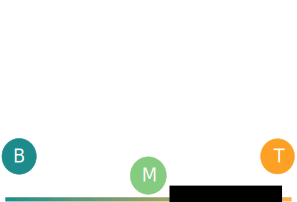]

.large[.center[Temperature]]

---
## State and Transition Model

.center[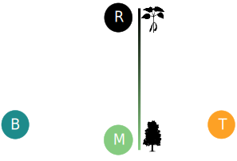]

---
## State and Transition Model

.center[]

$$P(T|R) = [\alpha_T (T+M)]$$

---
## State and Transition Model

.center[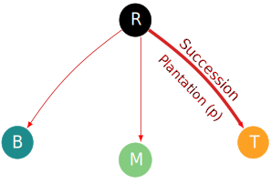]

$$P(T|R) = [\alpha_T (T+M)] \times (1 - p) + p$$

---
## State and Transition Model

.center[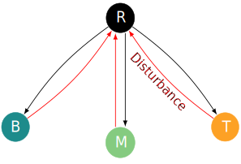]

$$P(R|B) = [\varepsilon]$$

---
## State and Transition Model

.center[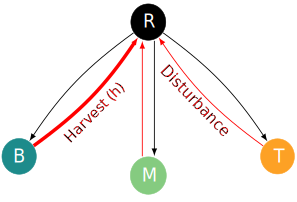]

$$P(R|B) = [\varepsilon \times (1 - h)] + h$$

---
## State and Transition Model

.center[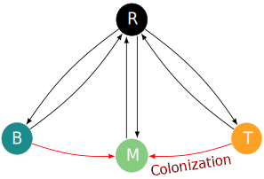]

$$P(M|B) = [\beta_T(T + M)]$$

---
## State and Transition Model

.center[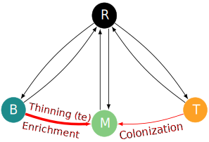]

$$P(M|B) = [\beta_T(T + M)] \times (1-te) + te$$

---
## State and Transition Model

.center[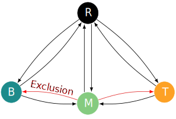]

---
class: inverse, center,  middle

## How management practices affect the response of forest to climate change?

### 1. Which mechanisms of the transitory phase are more affected?

```{r,echo=F,fig.height=4.2, fig.width=6}
par(xaxs="i", yaxs="i", mar = c(5, 5, 0, 0.5), bg = Green)
plot(x, y, pch = '', axes = FALSE, lwd = 3.5, xlab = "", ylab = "", ylim = c(-.1, 1.2), xaxt = "n", yaxt = "n")
lines(x, y, col = 'white', lwd = 3.5)
abline(h = min(y), lwd = 2, lty =2, col = 'white')
axis(1, at = c(-20, 20), lwd = 3, col = 'white')
axis(2, at = c(-5, 5), lwd = 3, col = 'white')
# deltaTime
pBrackets::brackets(-10, -0.14, 6.5, -.14, h = -.18,  ticks = 0.5, curvature = 0.5, type = 1, col = 'white', lwd = 1.8, lty = 1, xpd = T)
mtext(latex2exp::TeX('$\\Delta$Time'), col = 'white', side = 1, line = 3, at = -1.9, cex = 1.5)
# deltaState
pBrackets::brackets(-10.4, max(y), -10.4, min(y), h = -1.8,  ticks = 0.5, curvature = 0.5, type = 1, col = 'white', lwd = 1.8, lty = 1, xpd = T)
mtext(latex2exp::TeX('$\\Delta$abundance'), col = 'white', side = 2, line = 3.1, at = 0.5, cex = 1.5)
# Resilience
segments(1.5, 0.06, 6.5, -0.04, lwd = 2, col = 'white')
mtext(latex2exp::TeX('$R_\\infinity'), 1, cex = 1.5, at = 4.4, line = -2.8, col = 'white')
# Integral
xx <- x[x > -6.8]
yy <- y[x > -6.8]
xx <- c(xx[1], xx, xx[length(xx)])
yy <- c(0, yy, 0)
#polygon(xx, yy, col = 'gray')
mtext(latex2exp::TeX('$\\int A(t)dt$'), side = 1, line = -7.2, at = -4, cex = 1.3, col = 'white')
```

---

# State and Transition Model
