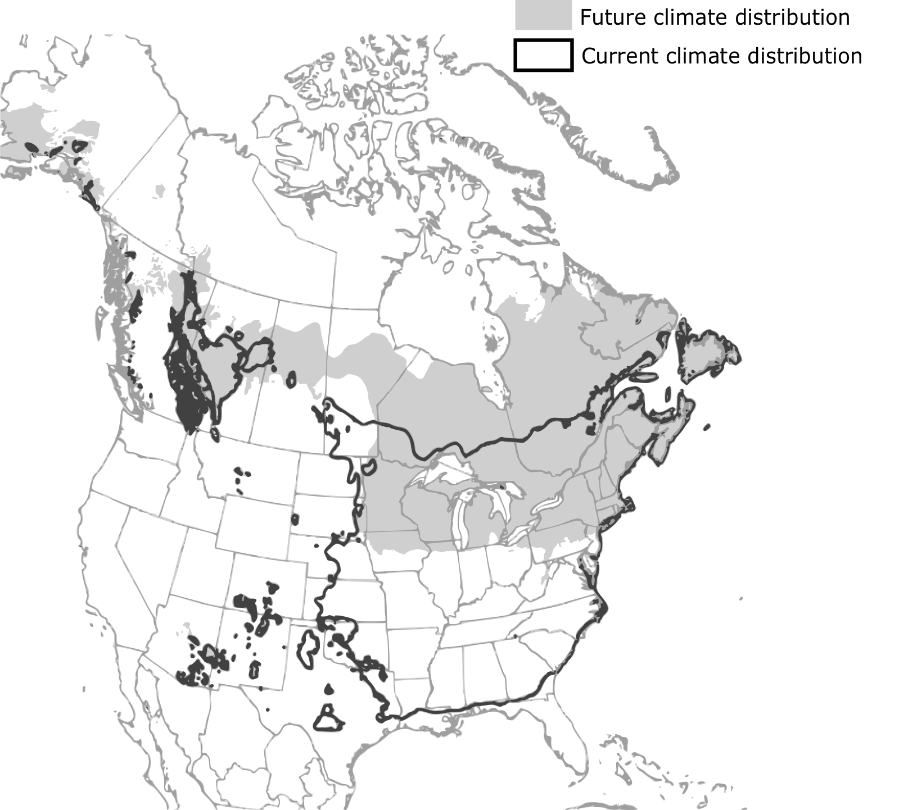
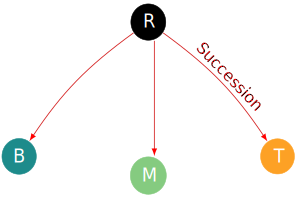
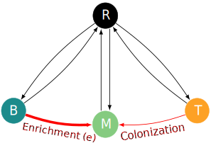

---
output:
  xaringan::moon_reader:
  #  self_contained: TRUE
    includes:
      in_header: conf/style-header.html
    lib_dir: assets
    seal: false
    css: ["default", "conf/css/style.css", "conf/css/fonts.css"]
    nature:
      beforeInit: "conf/style-macros.js"
---

```{r setup, echo = F}
knitr::opts_chunk$set(
  comment = "#",
  collapse = TRUE,
  #cache = TRUE,
  warning = FALSE,
  message = FALSE,
  fig.width=6, fig.height=6,
  fig.align = 'center'
)
```
class: middle, title-slide

# The effect of forest management on forest distribution under climate change

### .large[Willian Vieira], PhD candidate <br> Dominique Gravel and Robert Bradley

<i class="fa fa-github fa-2x" style="color:#335049"></i> [WillVieira/talk_STM-QCBS2018](https://github.com/willvieira/talk_STM-QCBS2018)

---
## Challenge: future distribution under climate change

.center[
  
]

.cite[McKenney et al. [2007](https://academic.oup.com/bioscience/article/57/11/939/234280) BioScience]

---
## Trees are lagging behind climate change

.center[]

.cite[Talluto et al. [2017](https://www.nature.com/articles/s41559-017-0182) Nat. Ecol. Evol.]

---
## Trees are lagging behind climate change

.center[]

### .center[Forest management?]

---
## Transitory dynamic under perturbation

```{r,echo=F}
## Figure to explain transitory dynamic
  sigmoid <- function(x) {
     1 / (1 + exp(-x))
  }
  # generate data
  x <- seq(-10, 10, 0.01)
  y <- sigmoid(-x)
  Green = rgb(51, 80, 73, maxColorValue = 255)
  Gray = rgb(90, 90, 90, maxColorValue = 255)
```
```{r,echo=F}
  # plot as a function
  transPlot <- function(transp = F) {
    letCol = ifelse(transp == T, 'grey', 'black')
    par(xaxs="i", yaxs="i", mar = c(5, 5, 2, 0.5))
    plot(x, y, pch = '', axes = FALSE, lwd = 3.5, xlab = "", ylab = "", ylim = c(-.1, 1.2), xaxt = "n", yaxt = "n")
    axis(1, at = c(-20, 20), lwd = 2.5)
    axis(2, at = c(-5, 5), lwd = 2.5)
    mtext("Time", 1, cex = 1.6, line = 0.6, col = letCol)
    mtext('Abundance', 2, cex = 1.6, line = 0.3, col = letCol)
  }
```
```{r,echo=F,fig.height=5, fig.width=7}
  # plot
  transPlot()
  mtext('', cex = 1.5, side = 3, line = -0.7, at = -6.8)
```

---
## Transitory dynamic under perturbation

```{r,echo=F,fig.height=5, fig.width=7}
transPlot()
lines(x[1:300], y[1:300], col = Green, lwd = 3.5)
mtext('', cex = 1.5, side = 3, line = -0.7, at = -6.8)
```

---
## Transitory dynamic under perturbation

```{r,echo=F,fig.height=5, fig.width=7}
transPlot()
lines(x[1:300], y[1:300], col = Green, lwd = 3.5)
mtext('Climate change', cex = 1.5, side = 3, line = -0.7, at = -6.8)
mtext(expression(symbol("\257")), at = -6.8, side = 3, line = -2.8, cex = 2.5, col = 'red')
abline(h = min(y), lwd = 2, lty =2, col = Gray)
mtext('New equilibrium after CC', cex = 1.4, side = 1, line = -2.5, at = -5, col = Gray)
```

---
## Transitory dynamic under perturbation

```{r,echo=F,fig.height=5, fig.width=7}
transPlot()
mtext('Climate change', cex = 1.5, side = 3, line = -0.7, at = -6.8)
mtext(expression(symbol("\257")), at = -6.8, side = 3, line = -2.8, cex = 2.5, col = 'red')
abline(h = min(y), lwd = 2, lty =2, col = Gray)
mtext('New equilibrium after CC', cex = 1.4, side = 1, line = -2.5, at = -5, col = Gray)
lines(x, y, col = Green, lwd = 3.5)
```

---
## Transitory dynamic under perturbation

```{r,echo=F,fig.height=5, fig.width=7}
transPlot(transp = T)
mtext('Climate change', cex = 1.5, side = 3, line = -0.7, at = -6.8, col = 'grey')
mtext(expression(symbol("\257")), at = -6.8, side = 3, line = -2.8, cex = 2.5, col = 'grey')
abline(h = min(y), lwd = 2, lty =2, col = Gray)
mtext('New equilibrium after CC', cex = 1.4, side = 1, line = -2.5, at = -5, col = 'grey')
lines(x, y, col = Green, lwd = 3.5)
# deltaTime
pBrackets::brackets(-10, -0.12, 6.5, -.12, h = -.2,  ticks = 0.5, curvature = 0.5, type = 1, col = 1, lwd = 2, lty = 1, xpd = T)
mtext(latex2exp::TeX('$\\Delta$Time'), side = 1, line = 3.8, at = -1.9, cex = 1.5)
```

---
## Transitory dynamic under perturbation

```{r,echo=F,fig.height=5, fig.width=7}
transPlot(transp = T)
mtext('Climate change', cex = 1.5, side = 3, line = -0.7, at = -6.8, col = 'grey')
mtext(expression(symbol("\257")), at = -6.8, side = 3, line = -2.8, cex = 2.5, col = 'grey')
abline(h = min(y), lwd = 2, lty =2, col = Gray)
mtext('New equilibrium after CC', cex = 1.4, side = 1, line = -2.5, at = -5, col = 'grey')
lines(x, y, col = Green, lwd = 3.5)
# deltaTime
pBrackets::brackets(-10, -0.12, 6.5, -.12, h = -.2,  ticks = 0.5, curvature = 0.5, type = 1, col = 1, lwd = 2, lty = 1, xpd = T)
mtext(latex2exp::TeX('$\\Delta$Time'), side = 1, line = 3.8, at = -1.9, cex = 1.5)
# deltaState
pBrackets::brackets(-10.1, max(y), -10.1, min(y), h = -2,  ticks = 0.5, curvature = 0.5, type = 1, col = 1, lwd = 2, lty = 1, xpd = T)
mtext(latex2exp::TeX('$\\Delta$abundance'), side = 2, line = 3.8, at = 0.5, cex = 1.5)
```

---
## Transitory dynamic under perturbation

```{r,echo=F,fig.height=5, fig.width=7}
transPlot(transp = T)
mtext('Climate change', cex = 1.5, side = 3, line = -0.7, at = -6.8, col = 'grey')
mtext(expression(symbol("\257")), at = -6.8, side = 3, line = -2.8, cex = 2.5, col = 'grey')
abline(h = min(y), lwd = 2, lty =2, col = Gray)
mtext('New equilibrium after CC', cex = 1.4, side = 1, line = -2.5, at = -5, col = 'grey')
lines(x, y, col = Green, lwd = 3.5)
# deltaTime
pBrackets::brackets(-10, -0.12, 6.5, -.12, h = -.2,  ticks = 0.5, curvature = 0.5, type = 1, col = 1, lwd = 2, lty = 1, xpd = T)
mtext(latex2exp::TeX('$\\Delta$Time'), side = 1, line = 3.8, at = -1.9, cex = 1.5)
# deltaState
pBrackets::brackets(-10.1, max(y), -10.1, min(y), h = -2,  ticks = 0.5, curvature = 0.5, type = 1, col = 1, lwd = 2, lty = 1, xpd = T)
mtext(latex2exp::TeX('$\\Delta$abundance'), side = 2, line = 3.8, at = 0.5, cex = 1.5)
# Resilience
segments(1.5, 0.06, 6.5, -0.04, lwd = 2)
mtext(latex2exp::TeX('$R_\\infinity'), 1, cex = 1.5, at = 4.4, line = -2.8)
```

---
## Transitory dynamic under perturbation

```{r,echo=F,fig.height=5, fig.width=7}
transPlot(transp = T)
mtext('Climate change', cex = 1.5, side = 3, line = -0.7, at = -6.8, col = 'grey')
mtext(expression(symbol("\257")), at = -6.8, side = 3, line = -2.8, cex = 2.5, col = 'grey')
abline(h = min(y), lwd = 2, lty =2, col = Gray)
mtext('New equilibrium after CC', cex = 1.4, side = 1, line = -2.5, at = -5, col = 'grey')
lines(x, y, col = Green, lwd = 3.5)
# deltaTime
pBrackets::brackets(-10, -0.12, 6.5, -.12, h = -.2,  ticks = 0.5, curvature = 0.5, type = 1, col = 1, lwd = 2, lty = 1, xpd = T)
mtext(latex2exp::TeX('$\\Delta$Time'), side = 1, line = 3.8, at = -1.9, cex = 1.5)
# deltaState
pBrackets::brackets(-10.1, max(y), -10.1, min(y), h = -2,  ticks = 0.5, curvature = 0.5, type = 1, col = 1, lwd = 2, lty = 1, xpd = T)
mtext(latex2exp::TeX('$\\Delta$abundance'), side = 2, line = 3.8, at = 0.5, cex = 1.5)
# Resilience
segments(1.5, 0.06, 6.5, -0.04, lwd = 2)
mtext(latex2exp::TeX('$R_\\infinity'), 1, cex = 1.5, at = 4.4, line = -2.8)
# Integral
xx <- x[x > -6.8]
yy <- y[x > -6.8]
xx <- c(xx[1], xx, xx[length(xx)])
yy <- c(0, yy, 0)
polygon(xx, yy, col = Green)
mtext(latex2exp::TeX('$\\int A(t)dt$'), side = 1, line = -8, at = -3, cex = 1.3, col = 'white')
```

---
class: inverse, center, middle

# How management practices affect the response of forest to climate change?

### 1. Which management practices are most effective in changing the transitory phase?
### 2. Can forest management increase the migration rate nortward?

---
## State and Transition Model

.center[]

.large[.center[Temperature]]

---
## State and Transition Model

.center[]

---
## State and Transition Model

.center[]

$$P(T|R) = [\alpha_T (T+M)]$$

---
## State and Transition Model

.center[]

$$P(T|R) = [\alpha_T (T+M)] \times (1 - p) + p$$

---
## State and Transition Model

.center[]

$$P(R|B) = [\varepsilon]$$

---
## State and Transition Model

.center[]

$$P(R|B) = [\varepsilon \times (1 - h)] + h$$

---
## State and Transition Model

.center[]

$$P(M|B) = [\beta_T(T + M)]$$

---
## State and Transition Model

.center[]

$$P(M|B) = [\beta_T(T + M)] \times (1-te) + te$$

---
## State and Transition Model

.center[]

---
class: inverse, center,  middle

## How management practices affect the response of forest to climate change?

### 1. Which management practices are most effective in changing the transitory phase?

```{r,echo=F,fig.height=3.9, fig.width=5.8}
par(xaxs="i", yaxs="i", mar = c(5, 5, 0, 0.5), bg = Green)
plot(x, y, pch = '', axes = FALSE, lwd = 3.5, xlab = "", ylab = "", ylim = c(-.1, 1.2), xaxt = "n", yaxt = "n")
lines(x, y, col = 'white', lwd = 3.5)
abline(h = min(y), lwd = 2, lty =2, col = 'white')
axis(1, at = c(-20, 20), lwd = 3, col = 'white')
axis(2, at = c(-5, 5), lwd = 3, col = 'white')
# deltaTime
pBrackets::brackets(-10, -0.14, 6.5, -.14, h = -.18,  ticks = 0.5, curvature = 0.5, type = 1, col = 'white', lwd = 1.8, lty = 1, xpd = T)
mtext(latex2exp::TeX('$\\Delta$Time'), col = 'white', side = 1, line = 3, at = -1.9, cex = 1.5)
# deltaState
pBrackets::brackets(-10.4, max(y), -10.4, min(y), h = -1.8,  ticks = 0.5, curvature = 0.5, type = 1, col = 'white', lwd = 1.8, lty = 1, xpd = T)
mtext(latex2exp::TeX('$\\Delta$abundance'), col = 'white', side = 2, line = 3.1, at = 0.5, cex = 1.5)
# Resilience
segments(1.5, 0.06, 6.5, -0.04, lwd = 2, col = 'white')
mtext(latex2exp::TeX('$R_\\infinity'), 1, cex = 1.5, at = 4.4, line = -2.8, col = 'white')
# Integral
xx <- x[x > -6.8]
yy <- y[x > -6.8]
xx <- c(xx[1], xx, xx[length(xx)])
yy <- c(0, yy, 0)
#polygon(xx, yy, col = 'gray')
mtext(latex2exp::TeX('$\\int A(t)dt$'), side = 1, line = -7.2, at = -4, cex = 1.3, col = 'white')
```

---
## Results

```{r,echo=F}
dat_enr = readRDS('data/dat_enr.RDS')
dat_harv = readRDS('data/dat_harv.RDS')
dat_plant = readRDS('data/dat_plant.RDS')

# ylim for each plot
dats <- c("dat_plant", "dat_harv", "dat_enr")
vars <- names(dat_plant)[2:6]
for(i in 1:length(vars)) {
    vec = c()
   for(j in 1:length(dats)) {
    vec = append(vec, get(dats[j])[,vars[i]])
  }
assign(paste0('range_', vars[i]), range(vec))
}
```

```{r, echo=F, fig.height=5, fig.width=7}
par(mfrow = c(2, 2), mar = c(3,3.35,0.4,1), mgp = c(1.5, 0.3, 0), tck = -.015, cex = 1.1)
# R_infinity
plot(get(dats[1])$managInt, get(dats[1])$R_inf, ylim = range_R_inf, type = 'l', lwd = 1.2, xlab = '', ylab = expression('-R'[infinity]))
for(i in 2:3) points(get(dats[i])[,'managInt'], get(dats[i])[,'R_inf'], type = 'l', lwd = 1.5, lty = i)
# deltaState (exposure)
plot(get(dats[1])$managInt, get(dats[1])$deltaState, ylim = range_deltaState, type = 'l', lwd = 1.5, xlab = '', ylab = expression(Delta ['state']))
for(i in 2:3) points(get(dats[i])[,'managInt'], get(dats[i])[,'deltaState'], type = 'l', lwd = 1.5, lty = i)
# detalTime (sensibility)
plot(get(dats[1])$managInt, get(dats[1])$deltaTime, ylim = range_deltaTime, type = 'l', lwd = 1.5, xlab = '', ylab = expression(paste(Delta ['Time'], ' (year*5)')))
for(i in 2:3) points(get(dats[i])[,'managInt'], get(dats[i])[,'deltaTime'], type = 'l', lwd = 1.5, lty = i)
# Integral
plot(get(dats[1])$managInt, get(dats[1])$integral, ylim = range_integral, type = 'l', lwd = 1.5, xlab = '', ylab = expression(integral(S(t)*dt)))
for(i in 2:3) points(get(dats[i])[,'managInt'], get(dats[i])[,'integral'], type = 'l', lwd = 1.5, lty = i)
mtext("Management intensity", 1, line = -1.3, cex = 1.2, outer = TRUE)
```

---
class: inverse, center, middle

# How management practices affect the response of forest to climate change?

### ~~1. Which management practices are most effective in changing the transitory phase?~~
### 2. Can forest management increase the migration rate nortward?

---
## Spatially explicit model


---
### Can forest management increase the migration rate nortward?
```{r,echo=F}
sim <- c('noManag', 'plantation', 'harvest', 'enrichment')
tbsB = as.character(expand.grid(paste0('boreal_', sim))[,1])
tbsT = as.character(expand.grid(paste0('temperate_', sim))[,1])
tbs = c(tbsB, tbsT)
for(tb in 1:length(tbs))
  assign(tbs[tb], readRDS(paste0('data/', tbs[tb], '.RDS')))

trans = 150
cols <- c(rgb(255, 0, 0, trans, maxColorValue = 255),
          rgb(57, 181, 74, trans, maxColorValue = 255),
          rgb(255, 255, 0, trans, maxColorValue = 255),
          rgb(255, 174, 3, trans, maxColorValue = 255))
```
```{r, echo=F, fig.height=5.2, fig.width=6.5}
par(mfrow = c(2, 1), cex = 1.1, cex.lab = 1.2)
# Temperate
par(mar = c(2,2.5,1,0.5), mgp = c(1.5, 0.2, 0), tck = -.015)
plot(0, pch = '', xlim = c(0, 1000), ylim = c(0, 1), xaxt = 'n', ylab = 'Temperate occupancy', xlab = '')
axis(side=1, labels = FALSE)
for(tbT in 1:length(tbsT)) {
  polygon(c(1:1000, rev(1:1000)),
        c(smooth.spline(get(tbsT[tbT])$mean + get(tbsT[tbT])$error, spar = 0.3)$y, rev(smooth.spline(get(tbsT[tbT])$mean - get(tbsT[tbT])$error, spar = 0.3)$y)),
        col = cols[tbT], border = FALSE)
  lines(smooth.spline(get(tbsT[tbT])$mean, spar = 0.3), lwd = 1)
}

# boreal
par(mar = c(3,2.5,0,0.5), mgp = c(1.5, 0.2, 0), tck = -.015)
plot(0, pch = '', xlim = c(0, 1000), ylim = c(0, 1), ylab = 'Boreal occupancy', xlab = 'Latitudinal gradient')
for(tbB in 1:length(tbsB)) {
  polygon(c(1:1000, rev(1:1000)),
        c(smooth.spline(get(tbsB[tbB])$mean + get(tbsB[tbB])$error, spar = 0.3)$y, rev(smooth.spline(get(tbsB[tbB])$mean - get(tbsB[tbB])$error, spar = 0.3)$y)),
        col = cols[tbB], border = FALSE)
  lines(smooth.spline(get(tbsB[tbB])$mean, spar = 0.3), lwd = 1, lty = 1)
}
mtext('Sept-Iles', side = 1, at = 50, line = 1.5, cex = 1.3)
mtext('Montréal', side = 1, at = 950, line = 1.5, cex = 1.3)
```

---
## Discussion

- Management has potential
  - Resilience
  - Migration rate
- Thinning + enrichment > plantation and harvest

### &#160; Open questions:

- Spatial variation?
- Local process?
  - Demography
  - Local management

---
class: inverse, center, middle

# Thank you!
## Questions?
